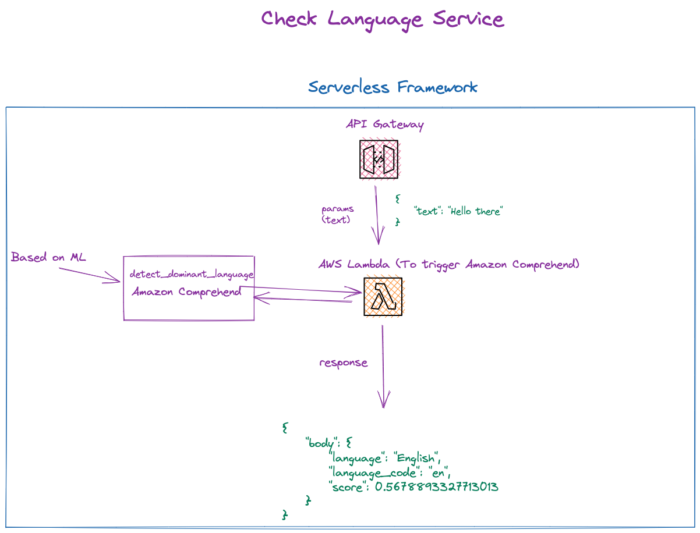

# Check language service with Amazon Comprehend (AWS Serverless with Ruby)

This is an example of using Amazon Comprehend to detect what language a text is written in. Used `Amazon Comprehend` for detection, `AWS Lambda` to communicate via `AWS SDK` with `Amazon Comprehend`, and API Gateway to trigger `lambda`.


## Diagram



## Setup

`npm install` to install all needed packages.

## Deployment

In order to deploy the service run:

```bash
sls deploy
```

for deploying with a specific `profile` (located in `~/.aws/credentials`) you can simply use the command:

```bash
AWS_PROFILE=YOUR_PROFILE_NAME sls deploy
```

for deploying to the specific stage, let's say `staging` do:

```bash
sls deploy --stage staging
```

The expected result should be similar to:

```bash
Serverless: Running "serverless" installed locally (in service node_modules)
Serverless: Packaging service...
Serverless: Excluding development dependencies...
Serverless: Clearing previous build ruby layer build
[ '2.2' ]
Serverless: Installing gem using local bundler
Serverless: Zipping the gemfiles to your-folder/.serverless/ruby_layer/gemLayer.zip
Serverless: Configuring Layer and GEM_PATH to the functions
Serverless: Uploading CloudFormation file to S3...
Serverless: Uploading artifacts...
Serverless: Uploading service check-language-service.zip file to S3 (870.06 KB)...
Serverless: Uploading service gemLayer.zip file to S3 (689.77 KB)...
Serverless: Validating template...
Serverless: Updating Stack...
Serverless: Checking Stack update progress...
...................
Serverless: Stack update finished...
Service Information
service: check-language-service
stage: dev
region: eu-central-1
stack: check-language-service-dev
resources: 12
api keys:
  None
endpoints:
  POST - https://XXXXXXXXXXXX.execute-api.your-region.amazonaws.com/dev/language
functions:
  check-language: check-language-service-dev-check-language
layers:
  gem: arn:aws:lambda:your-region:XXXXXXXXXXXX:layer:check-language-service-dev-ruby-bundle:11
```

## Usage


## Via Api Gateway

  After the deployment, grab the POST endpoint for this service. You can make a API call either by cURL or some tools like Postman.

Use payload like:

```json
{
  "text": "Cześć, jestem Daniel"
}
```

As a response you will get detected `language`, `language_code`, as well as `score` (`The level of confidence that Amazon Comprehend has in the accuracy of the detection`).
)

```json
{
    "body": {
        "language": "Polish",
        "language_code": "pl",
        "score": 1.0
    }
}
```


## Log retention

The log retention is setup for 30 days. To change it simply change the value of this attribute in `serverless.yml` file:


```bash
logRetentionInDays: 30
```

## Structure

| Path                                          | Explanation                                                                                                                                                     |
|-----------------------------------------------|-----------------------------------------------------------------------------------------------------------------------------------------------------------------|
| `./src`                                       | All code for the project.                                                                                                                                       |
| `./src/handlers/`                   | Handlers for lambda.                                                                                                                                             |
| `./src/common/`                               | Space for common, reusable pieces of code.                                                                                                                      |      
| `./src/common/services/language_detection_service.rb` | Responsible for making detection with Amazon Comprehend to detect language. |       

## Serverless plugins

For this example, there are two serverless plugins used:

| Plugin                | Explanation                                                                                    |
|-----------------------|------------------------------------------------------------------------------------------------|
| [serverless-ruby-layer](https://www.npmjs.com/package/serverless-ruby-layer) | For bundling ruby gems from `Gemfile` and deploys them to the lambda layer.                      |

## Ruby gems

| Gem                | Explanation                                                                                                                    |
|--------------------|--------------------------------------------------------------------------------------------------------------------------------|
| `aws-sdk-comprehend` | It's a part of the AWS SDK for Ruby. Used for Amazon Comprehend, in the case of this example - the detection of the PII data.          |
| `language_list` | To convert `language_code` to full language name |

## Remove service

To remove the service do:

```bash
sls remove
```
And the stack will be removed from the AWS.